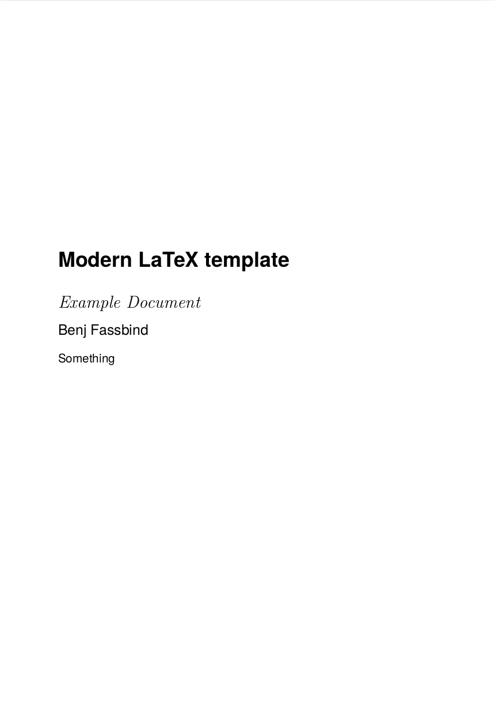
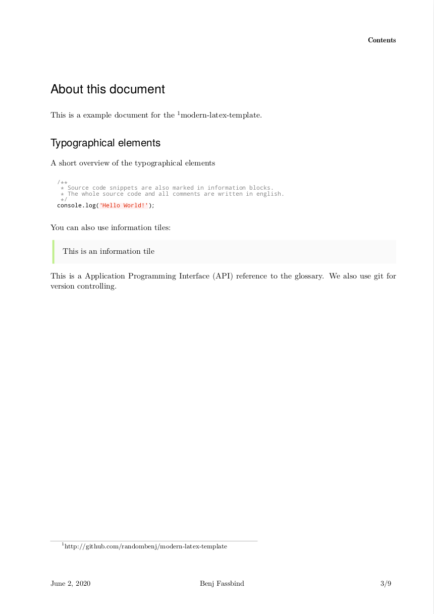
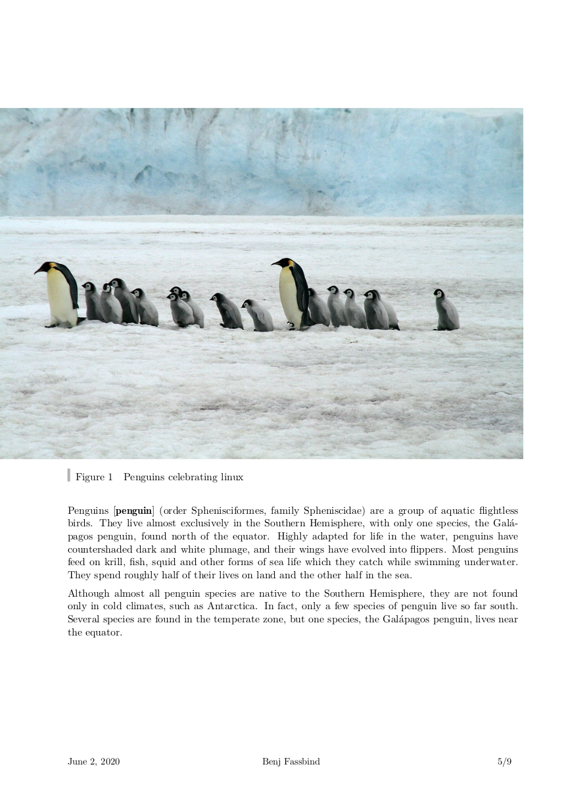

# **Modern** *LaTeX* pdf theme

[](https://github.com/randombenj/modern-latex-theme/actions)

An opinionated modern latex pdf theme for university notes/papers:

| Title page  | Typographic elements | Images |
| :------------------: | :------------------: | :------------------: |
|  |  |  |


Examples of the theme are built and published as releases.
Have a look at the **[example builds](https://github.com/randombenj/modern-latex-theme/releases)**.

## Installation

You can simply install the latex theme like this:

```sh
# install required dependencies
sudo apt install --yes texlive-base \
  texlive-bibtex-extra \
  texlive-binaries \
  texlive-extra-utils \
  texlive-font-utils \
  texlive-fonts-recommended \
  texlive-formats-extra \
  texlive-lang-english \
  texlive-lang-european \
  texlive-lang-german \
  texlive-latex-base \
  texlive-latex-extra \
  texlive-latex-recommended \
  texlive-luatex \
  texlive-pictures \
  texlive-generic-extra \
  texlive-fonts-extra \
  python-pygments
  

# install the template
git clone git@github.com:randombenj/modern-latex-theme.git
sudo cp modern-latex-theme/modern.cls /usr/local/share/texmf/tex/latex/
mktexlsr
```

If you want to use this theme with pandoc install it like this:

```sh
mkdir -p ~/.pandoc/templates
cp modern-latex-theme/latex.template ~/.pandoc/templates
```

## Use from Source

If you don't want to install the theme you need to set the `TEXINPUTS` environment variable to the location
the `modern.cls` file is in:

```sh
git clone git@github.com:randombenj/modern-latex-theme.git
export TEXINPUTS="$(pwd)/modern-latex-theme/:$TEXINPUTS"
```

## Use with selfhosted [overleaf](https://github.com/overleaf/overleaf)

Have a look here: https://github.com/randombenj/modern-latex-theme-overleaf

## Write docs

You can use the template in your *LaTeX* document and build like this:

```tex
\documentclass{modern}

\begin{document}

...

\end{document}

```

```sh
lualatex -interaction=nonstopmode -halt-on-error -shell-escape [FILE.tex]
```

To generate a pdf with pandoc, for example from a markdown
file simply run the following command:

```sh
pandoc \
  --template=latex.template \
  --pdf-engine=lualatex \
  --pdf-engine-opt="-shell-escape" \
  -o [OUTPUT.pdf] [INPUT.md]
```
